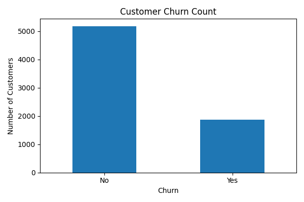
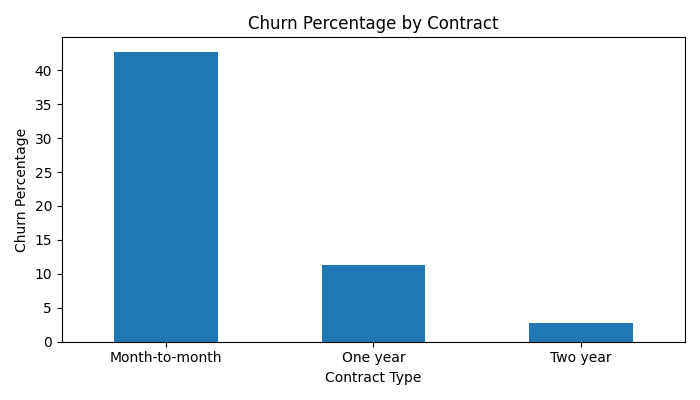
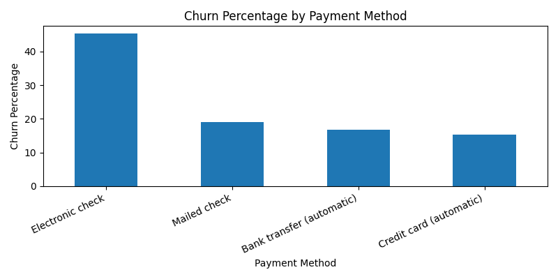
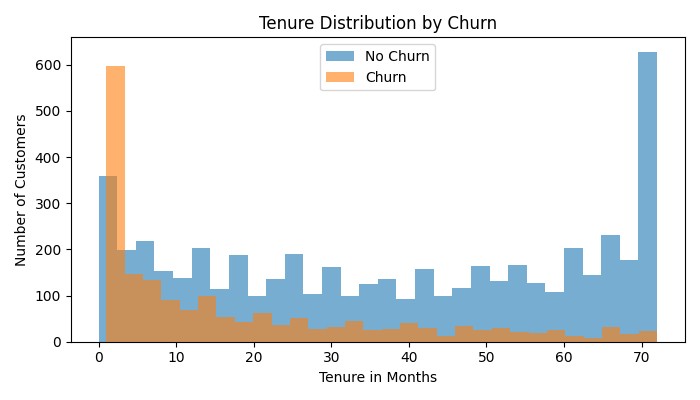

# Customer Churn Prediction Using Machine Learning

A machine learning project that predicts whether a telecom customer is likely to churn. The project includes data cleaning, exploratory data analysis, preprocessing pipelines, model training, evaluation, model saving, and a sample prediction script.

## Problem Statement

Customer churn happens when a customer stops using a company's service. The goal of this project is to identify customers who are likely to churn so the business can take early retention actions such as offers, support calls, or plan changes.

## Dataset

Dataset used: Telco Customer Churn dataset

- Rows: 7,043
- Columns: 21
- Target column: `Churn`
- Churned customers: 1,869
- Overall churn rate: 26.54%

The dataset is not included in this repository. Place it here before running the project:

```text
data/raw/customer_churn.csv
```

## Tools And Libraries

- Python
- pandas
- NumPy
- matplotlib
- seaborn
- scikit-learn
- joblib
- Git and GitHub

## Project Structure

```text
customer churn/
|-- data/
|   |-- raw/
|-- models/
|-- reports/
|   |-- figures/
|   |-- feature_importance.csv
|   |-- model_evaluation.md
|   |-- model_metrics.json
|-- src/
|   |-- check_data.py
|   |-- config.py
|   |-- eda.py
|   |-- predict.py
|   |-- train.py
|-- README.md
|-- requirements.txt
|-- summary.md
```

## Machine Learning Workflow

1. Loaded the customer churn dataset.
2. Inspected columns, data types, target distribution, and missing values.
3. Converted `TotalCharges` from text to numeric.
4. Split the data into training and testing sets using stratified sampling.
5. Separated numerical and categorical features.
6. Built preprocessing pipelines for missing value handling, scaling, and one-hot encoding.
7. Trained a Logistic Regression model with balanced class weights.
8. Evaluated the model using accuracy, precision, recall, F1-score, ROC-AUC, and confusion matrix.
9. Saved the trained model using joblib.
10. Created a prediction script to score a new customer.

## EDA Insights

- The dataset has an imbalanced target variable, with churn around 26.54%.
- Month-to-month contract customers show higher churn risk.
- Electronic check customers have higher churn compared with other payment methods.
- Customers with shorter tenure are more likely to churn.
- Customers with higher monthly charges are more likely to churn.
- Customers without tech support show higher churn risk.

## EDA Visuals

Churn distribution:



Churn by contract type:



Churn by payment method:



Tenure distribution by churn:



## Model

The project uses Logistic Regression as the baseline model.

Why Logistic Regression was chosen:

- Suitable for binary classification
- Easy to explain in interviews
- Works well as a strong baseline model
- Model coefficients can help understand important churn drivers

The model pipeline includes:

- Median imputation for numerical features
- Standard scaling for numerical features
- Most-frequent imputation for categorical features
- One-hot encoding for categorical features
- Logistic Regression classifier

## Model Results

Logistic Regression results:

- Accuracy: 73.8%
- ROC-AUC: 84.1%
- Churn recall: 78%

The model is useful for retention campaigns because recall is important in churn prediction. A higher churn recall means the model can identify many customers who are actually likely to churn.

After running `src/train.py`, the project also creates:

```text
reports/model_metrics.json
reports/model_evaluation.md
reports/feature_importance.csv
models/churn_model.joblib
```

## Business Interpretation

The model helps the business prioritize customers for retention campaigns. Instead of contacting every customer, the company can focus on customers with higher predicted churn probability.

Possible retention actions:

1. Offer discounts or loyalty benefits to high-risk month-to-month customers.
2. Provide better onboarding and support for new customers with low tenure.
3. Create personalized retention offers for customers with high monthly charges.
4. Bundle tech support for customers who do not currently use support services.

## How To Run

Create a virtual environment:

```powershell
py -3.13 -m venv .venv
```

Activate the environment:

```powershell
.\.venv\Scripts\Activate.ps1
```

Install dependencies:

```powershell
pip install -r requirements.txt
```

Add the dataset:

```text
data/raw/customer_churn.csv
```

Check the dataset:

```powershell
python src/check_data.py
```

Run EDA:

```powershell
python src/eda.py
```

Train and evaluate the model:

```powershell
python src/train.py
```

Run sample prediction:

```powershell
python src/predict.py
```


## Future Improvements

- Try Random Forest and Gradient Boosting models.
- Tune hyperparameters using cross-validation.
- Adjust the classification threshold to improve churn recall.
- Add SHAP or feature importance explanations.
- Build a simple Streamlit app for interactive churn prediction.

